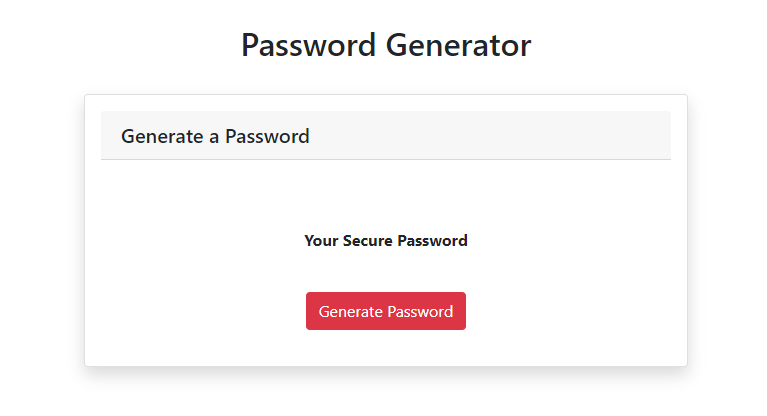

# Homework 3 - Password_Generator

The main goal for this homework assignment is to develop an application that would generate a random password based on pre-selected password critieria selected by an employee in need of a sensitive password. As specified in the instructional README.md file provide by the instructor (Antonio), the app must run on a browser and have a styled, responsive user interface that will dynamically resize to accomodate changes in screen size.

## User Story for Assignment

```
AS AN employee with access to sensitive data
I WANT to randomly generate a password that meets certain criteria
SO THAT I can create a strong password that provides greater security
```

## Acceptance Criteria for Assignment

```
GIVEN I need a new, secure password
WHEN I click the button to generate a password
THEN I am presented with a series of prompts for password criteria
WHEN prompted for password criteria
THEN I select which criteria to include in the password
WHEN prompted for the length of the password
THEN I choose a length of at least 8 characters and no more than 128 characters
WHEN prompted for character types to include in the password
THEN I choose lowercase, uppercase, numeric, and/or special characters
WHEN I answer each prompt
THEN my input should be validated and at least one character type should be selected
WHEN all prompts are answered
THEN a password is generated that matches the selected criteria
WHEN the password is generated
THEN the password is either displayed in an alert or written to the page
```

### Screenshot of How My App Renders in the Browser



## Additional Parameters Included in the Assignment

### Validating Password Criteria

In order to help ensure and validate that a secure password will be generated with at least one password criteria variable, I added a multi-parameter if-statment that would generate a secure password that includes lowercase, uppercase, numbers, and special characters as long as the user identified the number of characters that they want to be included in their secure password.

### Maintaining Required Character Length

The password length variable that I declared in the script.js file ensures that the secure password will have a total character length between 8 to 128, even if the user does enters a value outside of this required character range. Note that if the user choses to not enter a specified character length, the Math() method defining the variable will automatically generate an 8-character long password.
